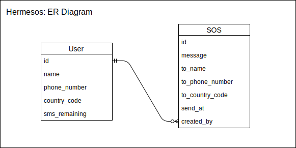

# Hermesos: iOS Client

Schedule an SMS to your friend if you feel unsafe.

## Dev Dependencies

- Git
- Xcode 9.4.x with Swift4
- Cocoapods 1.5.x

## Setup

	git clone <repo>
	cd <projectDir>
	pod install
	[open .xcworkspace file]
	
## Scope Assumptions

1. This app is primarily a client that communicates with the backend server over a REST API.
2. Entities:  

## Known Limitations

1. No catching strategy when internet connection is not available.
2. Proper UI notice when connection fails or content is empty.
3. A General Sleek UI
4. Proper input validation and helpful error messages valiation failure.
5. Helpful error messages when request fail.
	
## 3rd-Party Packages

1. [Alamofire](https://github.com/Alamofire/Alamofire) - For handling HTTP requests and response.
2. [SwiftyJSON](https://github.com/SwiftyJSON/SwiftyJSON) - For easier handling of JSON objects from API calls.
3. [SVProgressHUD](https://www.cocoacontrols.com/controls/svprogresshud) - Progress indicator for async tasks.
